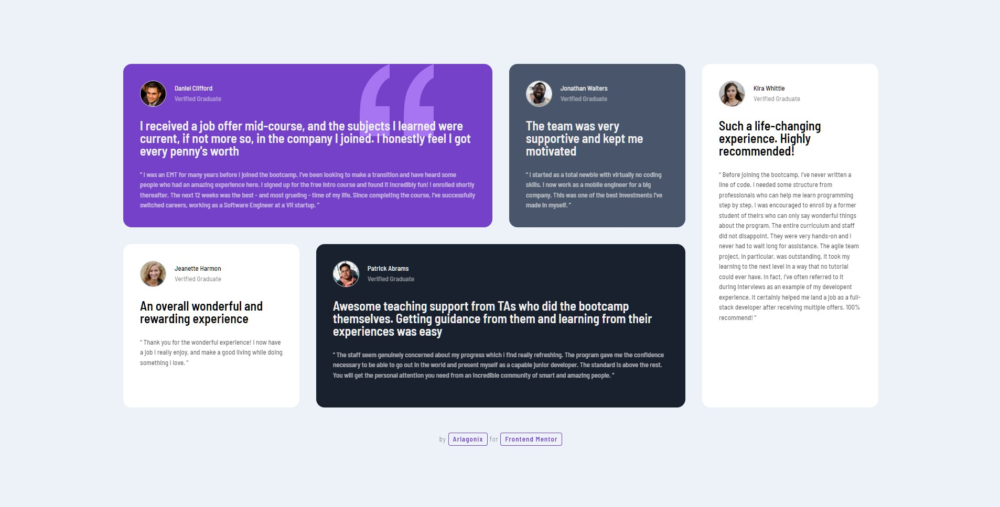
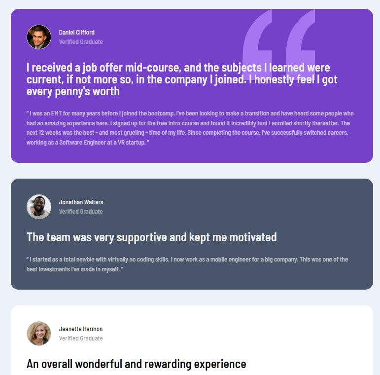

<h1 align="center">Testimonials Grid Section</h1>
<p align="center">
  Coded with <code>HTML</code>, <code>CSS</code>
</p>

<p align="center">
  
</p>

<p align="center">
  
</p>

## ℹ️ About

This is a solution to the [Testimonials grid section challenge on Frontend Mentor](https://www.frontendmentor.io/challenges/testimonials-grid-section-Nnw6J7Un7).

* **Build out a testimonials grid section**
  * `/design` - Folder with  designs. Contains both a mobile and a desktop version of the design. 
  * `/images` - Folder with assets. The assets are already optimized.
  * `style-guide.md` - File with the style information: color palette, fonts, etc.
* **Get it looking as close to the design as possible**. 
* **Use any tools to like**. You can use any tools you like to help you complete the challenge**. So if you've got something you'd like to practice, feel free to give it a go.
* **Your users should be able to**:
  * View the optimal layout for the site depending on their device's screen size

## ⚙️ Tools

* **HTML5**
  * Semantic HTML
* **CSS**
  * BEM naming convention
  * Responsive design
  * Flexbox
  * Grid
* **Github Pages** - for hosting

## 💡 Features

* **Grid**. First time using it
* **Animation on hover and click**. Yes! Hahahaha!
* **Moving gradient background**. It really moves!

## 🔗 Useful resources

- [Codepen : Hyperplexed](https://codepen.io/Hyperplexed/pen/vYpXNJd) - Got some inspiration for the hover animations
- [Codepen : Epogee Design](https://codepen.io/epogeedesign/pen/dyGOZoQ?editors=1100) - Got background gradient animation

## 📍 Additional information

### Moving gradient background

```css
.page {
  background: linear-gradient(-45deg, #ee7752, #e73c7e, #23a6d5, #23d5ab);
  background-size: 400% 400%;
	animation: gradient 15s ease infinite;
}

@keyframes gradient {
	0% { background-position: 0% 50%; }
	50% { background-position: 100% 50%; }
	100% { background-position: 0% 50%; }
}
```

### Nice transform animation

```css
.card:hover .card__header {
  transform: translateY(-8px);
}

.card:hover .user {
  transform: translateY(4px);
}

.card:hover .card__review {
  transform: translateY(-16px);
}
```

## 👤 Author

* Frontend Mentor - [@GrbnvAlex](https://www.frontendmentor.io/profile/GrbnvAlex)
* Telegram - [@Arlagonix](https://t.me/Arlagonix)
* Github - [@arlagonix](https://github.com/arlagonix)
